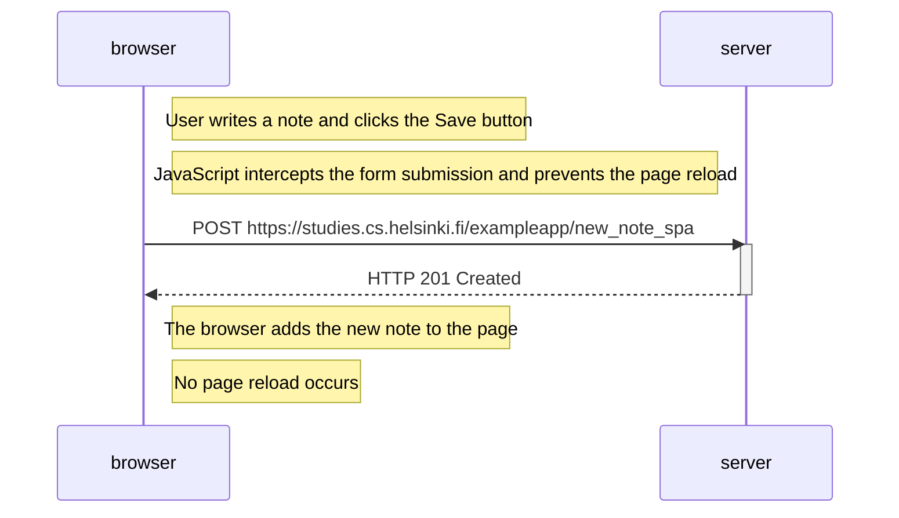

```mermaid
sequenceDiagram
    participant browser
    participant server

    Note right of browser: User writes a note and clicks the Save button

    Note right of browser: JavaScript intercepts the form submission and prevents the page reload

    browser->>server: POST https://studies.cs.helsinki.fi/exampleapp/new_note_spa
    activate server
    server-->>browser: HTTP 201 Created
    deactivate server

    Note right of browser: The browser adds the new note to the page

    Note right of browser: No page reload occurs
```